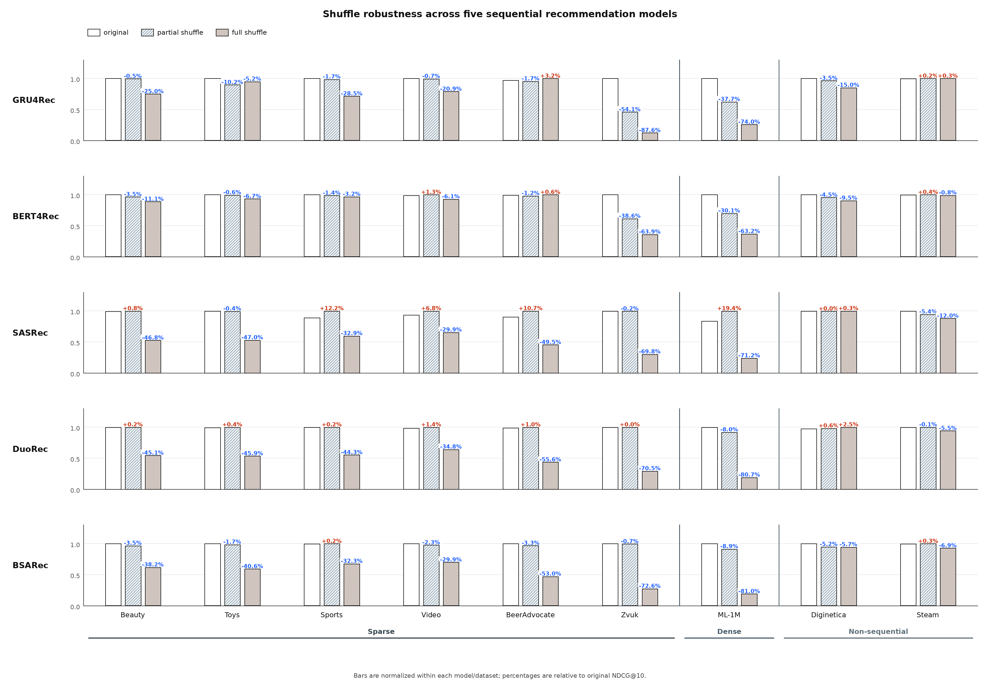
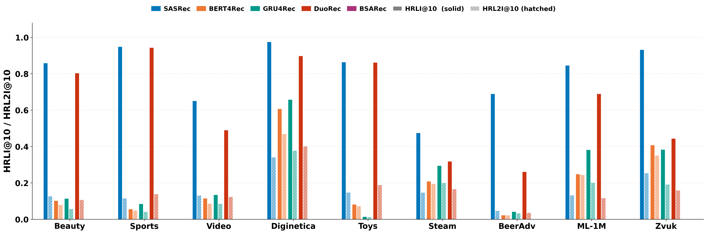

# RecSys2026 Submitted

This repository contains the code for:
Residual Dominance Drives Last-Item Reliance in Causal Self-Attention for Sequential Recommendation.

This repository runs norm-based analysis of SASRec on top of the `time-to-split` codebase.
For full experimental pipelines and reproducibility details, see `time-to-split/README.md`.

## Section 2.2 Dataset Statistics

### Statistics of the processed datasets

Statistics of the processed datasets after $p$-core filtering ($p=5$) and consecutive-repeat removal.

| Dataset | #Users | #Items | #Interact. | Avg.Len | Density | #Days |
| :--- | ---: | ---: | ---: | ---: | ---: | ---: |
| Beauty | 22,363 | 12,101 | 198,502 | 8.9 | 0.07% | 4,424 |
| Sports | 35,598 | 18,357 | 296,337 | 8.3 | 0.05% | 4,521 |
| Video | 24,303 | 10,672 | 231,780 | 9.5 | 0.09% | 5,395 |
| Diginetica | 61,279 | 25,593 | 485,903 | 7.9 | 0.03% | 152 |
| Toys | 19,412 | 11,924 | 167,597 | 8.6 | 0.07% | 5,108 |
| Steam | 281,349 | 11,961 | 3,550,272 | 12.62 | 0.11% | 2,639 |
| BeerAdvocate | 14,635 | 22,074 | 1,475,412 | 100.8 | 0.46% | 5,620 |
| ML-1M | 6,040 | 3,416 | 999,611 | 165.5 | 4.84% | 1,038 |
| Zvuk | 19,267 | 150,206 | 8,087,953 | 419.8 | 0.28% | 91 |

## Section 3.1 Results (all datasets)

The figure below shows results on nine datasets when inputs are shuffled at inference time.



## Section 3.2 Results (K=10)

The image below shows HRLI and HRL2I computed at K=10.




## Section 4.2 Heatmap (all datasets)

Heatmap figures for all datasets are saved under:
`time-to-split/section4_2_attention_heatmaps/`


## Section 5.1 Inference-Time Probing of Residual Contribution (all datasets)

Residual scaling probe figures for the nine datasets are saved under:
`time-to-split/section5_1_residual_contribution_plots/`

Each dataset directory contains:
- `residual_scaling_vs_hrli_attnresln.pdf`
- `hrli_vs_accuracy.pdf`

## Section 5.4 Validation-Based Selection (all datasets)

Validation-based alpha selection and oracle-comparison figures for all datasets are saved under:
`time-to-split/section5_4_alpha_oracle_epsilon_plots/`

Each dataset directory contains:
- `alpha_selection_comparison.png`
- `epsilon_vs_performance.png`

The plotted values are summarized in:
`time-to-split/section5_4_alpha_oracle_epsilon_plots/summary.csv`

## Structure
- `time-to-split/`: Research codebase (vendored from the original repository)

## SASRecAnalyze: How to Run the Analysis

SASRecAnalyze saves per-batch analysis `.npz` during prediction. The default config already enables
`seqrec_module.save_analysis_npz: true`.

### 1) Train/evaluate with SASRecAnalyze

Run training with the analysis model. Use any dataset/split supported by `time-to-split`:

```bash
cd time-to-split
python runs/train.py model=SASRecAnalyze split_type=leave-one-out dataset=Beauty
```

### 2) Locate analysis outputs

Analysis files are saved under:

```
$SEQ_SPLITS_DATA_PATH/results/analysis/SASRecAnalyze/<dataset>/<split_type>/seed_<seed>/
```

### 3) Generate analysis plots/statistics

Edit `time-to-split/src/analyze.py` and set:

```python
analysis_dir = "./data/results/analysis/SASRecAnalyze/Movielens-1m/global_timesplit/seed_17"
```

Then run:

```bash
python src/analyze.py
```

Outputs include mixing-ratio statistics and average heatmaps, saved under:
`figures_avg_recent15_sourceDown/` inside the analysis directory.

## Notes

- Detailed data prep, split strategies, and training options live in `time-to-split/README.md`.
